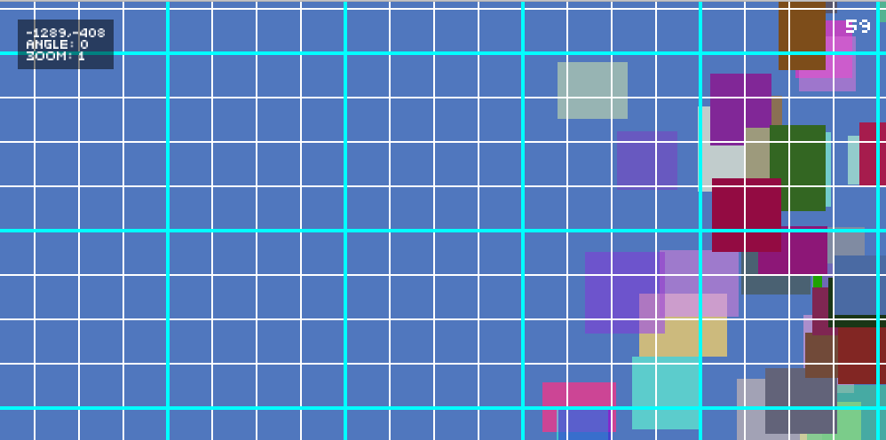

# Comora

A simple 2D camera for [Monogame](http://www.monogame.net/).

## Install

Available on NuGet

[](https://www.nuget.org/packages/Comora/)

## Quickstart

```sharp
private Camera camera;

protected override void Initialize()
{
	this.camera = new Camera(this.graphics);
	
	base.Initialize();
}

protected override void Update(GameTime gameTime)
{
	this.camera.Update(gameTime);
	
	this.camera.Position = Mouse.GetState().Position.ToVector2();
	
	base.Update(gameTime);
}

protected override void Draw(GameTime gameTime)
{
    graphics.GraphicsDevice.Clear(Color.CornflowerBlue);
    
	spriteBatch.Begin(this.camera);
	// Draw here
	spriteBatch.End();

	base. Draw(gameTime);
}

```

## Draw

Through the `SpriteBatch` extension methods, simply call `Begin` as usual, but with your camera :

```csharp
spriteBatch.Begin(this.camera);
```

You can add a parralax factor too :

```csharp
spriteBatch.Begin(this.camera, new Vector2(0.85f,0.85f));
```
## Animations

Trigger camera movements with various built-in or custom animations.

* `camera.Move(TimeSpan duration, [Vector2 from = current,] Vector2 to, Easing.Mode easing)` : moves the camera to a given position.
* `camera.Rotate(TimeSpan duration, [float from = current,] float to, Easing.Mode easing)` : rotates the camera to a given angle.
* `camera.Zoom(TimeSpan duration, [float from = current,] float to, Easing.Mode easing)` : scales the camera to a given zoom level.
* `camera.Shake(TimeSpan duration[, float intensity = 60])` : shakes the screen.


You can chain animations with fluent APIs :

```csharp
camera.Move(TimeSpan.FromSeconds(2),new Vector2(300,200))
	  .ThenWait(TimeSpan.FromSeconds(1))
	  .ThenZoom(TimeSpan.FromSeconds(1),2, Easing.Mode.EaseOut)
	  .ThenShake(TimeSpan.FromSeconds(0.5),100);
```


Finally, you can provide your own animations by using the base `Camera` methods or by providing `ICameraAnimation` implementation :

```csharp
camera.StartAnimation().Then(TimeSpan.FromSeconds(1), (cam,time) => cam.Position = new Vector2((float)time * 200, (float)time * 400));
```
## Conversion

You can convert a point from screen unit to world :

```csharp
camera.ToWorld(Vector.Zero);
```

Converting world coordinates to screen coordinates is also possible.

```csharp
camera.ToScreen(Vector.Zero);
```

## Debug tools



The framework provide several tools for debugging purpose.

```csharp
camera.Debug.IsVisible = Keyboard.GetState().IsKeyDown(Keys.F1);
```

Make sure to load content too :

```csharp
this.camera.LoadContent(GraphicsDevice);
```

And then draw it with `Draw` extension method. You don't have to call `spriteBatch.Begin` and `spriteBatch.End` which are already invoked by the method.

```csharp
this.spriteBatch.Draw(this.camera.Debug);
```

### FPS

The number of frame per seconds will be displayed on the layer.

### Grid

A visual grid for world units.

```csharp
// To draw a white line of size 2 every 50 world units
// and a red one of size 4 every 200 world units.
camera.Debug.Grid.AddLines(50, Color.White, 2);
camera.Debug.Grid.AddLines(200, Color.Red, 4);
```

## Roadmap / Ideas

* Integrate shaders for easy screen effects.
* Add more built-in animations.
* Easier parralax management.
* Clean and improve debug layer.

## Why?

"Seriously, just a camera ?" ... Yes! I often see full engines with tons of stuff I never need. I'm looking about modularity and easy APIs (like many awesome [LÖVE](https://love2d.org/) libraries) and that's why I created **Comora**. I'm sure this could be useful for someone else.

## Thanks

* [david-gouveia](http://www.david-gouveia.com/portfolio/2d-camera-with-parallax-scrolling-in-xna/)
* [Monogame.Extended](https://github.com/craftworkgames/MonoGame.Extended)

## Contributions

Contributions are welcome! If you find a bug please report it and if you want a feature please report it.

If you want to contribute code please file an issue and create a branch off of the current dev branch and file a pull request.

### License

MIT © [Aloïs Deniel](http://aloisdeniel.github.io)